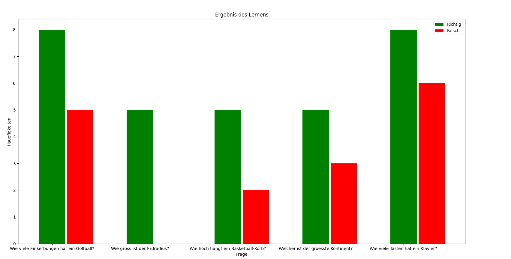

# 0 Agenda 
* [Einfuehrung](#einf)
* [Technologien](#tech)
* [Installation](#installation)
* [Dokumentation](#doc)

<a name="einf"/>
 
# 1 Einfuehrung 

## 1.1 Anmerkung 
Das Programm ist momentan **nur** fuer **Debian-based** Linux-Distrubutionen ausgelegt.

## 1.2 Ziel und Intention
Das Lernprogramm verfolgt das klassische Prinzip des Karteilernens.

Intention der Entwicklung ist das Selbstudium mit Python.
Das Programm ist mit Absicht auf Deutsch entwickelt worden,  
da es auch im privaten Gebrauch meinerseits eingesetzt wird.  
Weitere Projekte sind definitiv auf Englisch geplant.


## 1.3 Prinzip des Lernprogramms:
### Deutsch   
https://de.wikipedia.org/wiki/Lernkartei

### Englisch 
https://en.wikipedia.org/wiki/Flashcard

<a name="tech"/>

# 2 Technologien 
* matplotlib 3.4.0
* numpy      1.20.2
* pandas     1.2.3
* tk         0.1.0
* sqlite3    3.33.0
* matplotlib 3.4.0

<a name="installation"/>

# 3 installation
```
git clone https://github.com/DoganGuendogdu/Karteikarten.git 
cd Karteikarten
pip3 install -r requirement.txt
python3 main.py
```
<a name="doc"/>

# 4 Dokumentation

## 4.1 Kriterien der einzulesenen Datei
* Es sind lediglich Dateien im CSV-Format erlaubt.
* Frage und Anwort muessen durch ein **Komma** getrennt werden  
* Hierbei spielen White Spaces **keine** Rolle
 
 ### 4.1.1 Beispiel CSV
 


## 4.2 Ablauf Programm 

### 4.2.1 Datei entgegennehmen
 
  
### 4.2.2 Lernprogramm


### 4.2.3 Ergebnis der Lernsession
Nach Ende des Durchlaufs wird eine Statistik mit Anzahl der Fragen  
sowie der prozentuale Wert des Lernerfolgs festgelegt.  
 

### 4.2.4 weitere Lernsessions
Wenn nach dem ersten Durchlauf noch Karten in der ersten Box,  
also der eingelesenen Datei existieren,  
so muss fuer die naechsten Durchlaeufe dieselbe Datei zu Beginn eingelesen werden.

Nach der ersten Session ist zu sehen,  
wie oft die gestellte Frage falsch oder richtig beantwortet worden ist.    
 

### 4.2.5 Datenbank
Wenn **alle** Fragen in der eingelesenen Datei erfolgreich beantwortet worden sind,  
so wird automatisch eine Datenbank mittels sqlite3 erstellt.  
 

### 4.2.6 Plot Ergebnis
Bei Bedarf kann der User entscheiden, ob das Ergebnis geplotet werden soll.  
 


